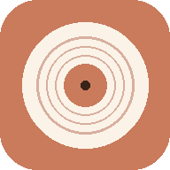

# 🎵 Vibe — Offline Music Studio

Hey Hackclubbers! 👋

Vibe is a little music app that I built. The simple idea behind it is — turn your phone or laptop into a whole set of instruments that you can actually play. I spent a good amount of time trying to make the sounds feel close to real instruments, and not just random beeps.

So you get a real "touch" feeling for piano and violin type instruments, and for the flute you literally use your breath. The whole thing runs in the browser and even works when you are offline.

> Real touch for piano and violin type instruments, and real breath for the flute — I tried to keep everything as close to real as possible.

## 📺 Demo Video

<video src="https://lakkeychoudhary.github.io/Vibe/screenshots/demo.mp4" controls width="100%" style="border-radius: 12px; margin: 16px 0; max-height: 400px;"></video>

*If the video player doesn't load, you can [watch it directly in your browser here](https://lakkeychoudhary.github.io/Vibe/screenshots/demo.mp4).*

---

## ✨ What You Can Do

- **Lots of instruments:** Play piano, flute, guitar, sitar, harmonium, violin, tabla, dholak, drums and more.
- **Sing and it listens:** There is a pitch engine, so you can sing or hum and the app figures out the note in real time and plays the instrument for you.
- **Play with your keyboard:** Every instrument is mapped to your computer keys, so you can jam without even touching the screen.
- **Works on everything:** Phone, tablet or desktop — the layout adjusts itself, and touch works too.
- **Fully offline app (PWA):** You can install it on your home screen (iOS and Android), and it still opens without internet because of service workers.
- **No build step:** It uses React and Babel straight from a CDN, so there is no compiling or heavy setup. You just open it and it runs.

### ⌨️ Keyboard Map

Here is how to play using your keyboard:

- **Piano / Harmonium / Sitar / Violin:** `A` `S` `D` `F` `G` `H` `J` `K` `L` `;` `'` play the notes in the chosen scale.
- **Guitar:** Pluck the strings (E, A, D, G, B, e) with `1` `2` `3` `4` `5` `6`. Strum the chords (C, G, Am, F, D, Em, Dm) with `Q` `W` `E` `R` `T` `Y` `U`.
- **Tabla:** Play the bols (Dha, Dhin, Na, Tin, Ge, Ka) with `A` `S` `D` `F` `G` `H`.
- **Drum Kit & Dholak:** Hit the pads with `A` `S` `D` `F`.

---

## 🛠️ How It Works

I kept the whole thing light — just a simple frontend, no heavy framework setup.

- **`index.html`** — the starting point. It loads React and Babel from a CDN.
- **`assets/audio.js`** — my own little sound engine built on the Web Audio API. It handles the oscillators, the envelope (how a note starts and fades), and sends the sound out.
- **`assets/pitch.js`** — the part that listens to your mic and finds the note you are singing, using autocorrelation/FFT.
- **`assets/app.jsx` & `assets/screens.jsx`** — the main app, the screen switching, and the state.
- **`assets/piano-flute.jsx` & `assets/other-instruments.jsx`** — the actual instrument components you see and play.

---

## 💻 Run It On Your Computer

The app needs mic access (for the singing part) and uses service workers, so it has to be opened from `http://localhost` (or `http://127.0.0.1`) — not by just double clicking the file.

Any simple static server works. Pick whichever one you have:

**Node.js**
npx http-server . -p 8080

**Python**
python -m http.server 8080

## 📦 Deployment

This project auto-deploys to **GitHub Pages**. Every time I push to the `main` branch, a GitHub Actions workflow builds it and puts the latest version live. You can find the setup in `.github/workflows/deploy.yml`.

---

Made with a lot of trial and error (and a few late nights) by me. Hope you have fun playing with it! 🎶
